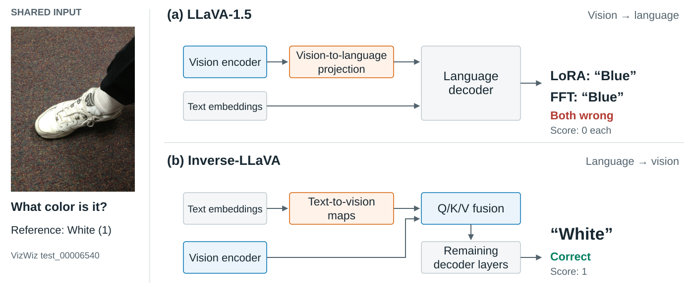

<p align="center">
  
</p>

<p align="center">
  <a href="https://arxiv.org/abs/2508.12466">Paper</a> ·
  <a href="docs/training.md">Training</a> ·
  <a href="docs/evaluation.md">Evaluation</a> ·
  <a href="docs/analysis.md">Analysis</a> ·
  <a href="docs/checkpoints.md">Checkpoints</a>
</p>

Inverse-LLaVA brings language features into the visual feature space for fusion
inside the language decoder. The model learns its fusion parameters and LoRA
adapters jointly from visual instructions, without a separate alignment-pretraining
stage.

<p align="center">
  
</p>

The example is selected from VizWiz: Inverse-LLaVA answers correctly,
while both official LLaVA-1.5 references answer incorrectly. It illustrates one
model behavior; aggregate results cover the full benchmark.
[Example provenance and image credit](assets/README.md).

## Method

At selected decoder layers, separate text-to-vision maps produce Q, K and V
updates. Visual features enter these branches at their encoder width; the fused
updates return to the language attention width. The original language path is
retained.

[Architecture diagram](assets/architecture.svg) ·
[Tensor shapes, masks and initialization](docs/method/METHOD_CONTRACT.md)

The 7B reference uses Vicuna-7B-v1.5, CLIP ViT-L/14 at 336 pixels, final-layer
visual features and fusion at decoder layer 0. Inverse-LLaVA-HD concatenates
the penultimate and final CLIP features along channels. Model, data and runtime settings are independent
YAML configurations, with explicit recipes for component and scaling studies.

## Results

Complete evaluations compare the retrained Inverse-LLaVA checkpoint with
official LLaVA-1.5 LoRA and full-fine-tuning (FFT) checkpoints. These are shared
evaluation protocols, not training-matched comparisons.

| Benchmark | Inverse-LLaVA | LLaVA-LoRA | LLaVA-FFT |
|---|---:|---:|---:|
| VQAv2 test-dev | 78.45 | 79.13 | 78.55 |
| GQA | 62.28 | 62.63 | 61.89 |
| VizWiz | 50.96 | 48.56 | 50.64 |
| ScienceQA-IMG | 69.61 | 68.82 | 69.11 |
| TextVQA | 56.96 | 58.47 | 58.21 |
| MMBench EN | 62.63 | 67.10 | 65.12 |
| MMBench CN | 54.04 | 58.93 | 58.33 |
| MME perception | 1453.82 | 1484.58 | 1507.28 |
| MME cognition | 279.29 | 258.21 | 344.64 |
| MM-Vet | 28.67 | 31.24 | 29.68 |

Values are percentages except MME's official scores. MME perception and cognition
are two parts of one benchmark. MM-Vet uses the recorded hosted-judge protocol.
The reference training uses 665K instruction examples; LLaVA additionally uses
558K alignment examples. This is a 45.6% reduction in training examples, without
implying the same reduction in training time or FLOPs.

## Installation

Use Linux with a CUDA-compatible PyTorch installation for model execution.

```bash
python -m venv .venv
source .venv/bin/activate
python -m pip install -e ".[dev,analysis,tracking]"
invllava --help
pytest tests -m "not gpu and not network and not slow"
```

The [container](containers/README.md) and [pinned requirements](requirements/README.md)
provide the verified x86/CUDA environment. TensorBoard and local JSONL metrics
work without an online account. Optional W&B logging uses the same saved metrics;
checkpoints remain ordinary files on your storage.

## Reproduce and extend

1. [Prepare data and train](docs/training.md): pinned sources, image checks,
   the reference recipe, checkpoints and exact resume.
2. [Evaluate](docs/evaluation.md): official prompts and scoring, baseline
   checkpoints, local benchmarks and external submissions.
3. [Analyze](docs/analysis.md): training curves, matched inference profiles,
   representations and recorded qualitative cases.
4. [Use a checkpoint](docs/checkpoints.md): the native safetensors format,
   verification and Hugging Face loading.

A training run records its resolved configuration, source identity, data
manifest, seed, metrics and checkpoint hashes. Keep those records together with
raw predictions and score manifests.

```text
assets/       logo, method diagrams and their provenance
configs/      model, data, runtime and experiment recipes
containers/   pinned CUDA environment
docs/         method and reproducibility guides
requirements/ dependency locks and installation checks
scripts/      training, evaluation and analysis entry points
src/invllava/ implementation
tests/        model, data, checkpoint and scorer contracts
third_party/  pinned evaluator references and notices
```

[Code architecture](docs/extension/CODE_ARCHITECTURE.md) ·
[Add a benchmark](docs/extension/ADDING_A_BENCHMARK.md) ·
[Contributing](CONTRIBUTING.md)

## Citation and terms

See [CITATION.cff](CITATION.cff) and the
[paper](https://arxiv.org/abs/2508.12466).
Source code is licensed under [Apache-2.0](LICENSE). Vicuna/Llama 2 model
weights and datasets retain their separate terms; see
[third-party notices](THIRD_PARTY_NOTICES.md).
